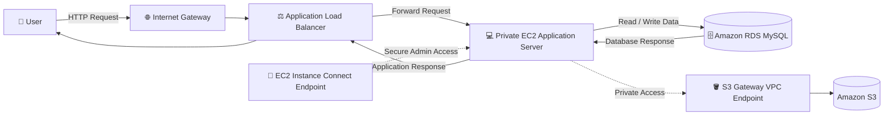

# ⚙️ Execution Workflow

## Workflow Diagram

---

## Workflow

1. The user accesses the application through the **Application Load Balancer (ALB)**.
2. The request enters the VPC through the **Internet Gateway (IGW)**.
3. The **ALB** forwards the request to the private **Amazon EC2** application server.
4. The EC2 instance processes the request and communicates with the private **Amazon RDS MySQL** database when data is required.
5. Amazon RDS returns the requested data to the EC2 instance.
6. The EC2 instance sends the response back to the ALB.
7. The ALB returns the response to the user's browser.

## Administrative Access

- Administrators securely connect to the private EC2 instance using the **EC2 Instance Connect Endpoint**, eliminating the need for a bastion host or public SSH access.

## Amazon S3 Access

- The EC2 instance accesses Amazon S3 privately through the **Gateway VPC Endpoint**, allowing secure S3 connectivity without requiring a NAT Gateway.

## Security

- **ALB** accepts HTTP traffic from the internet.
- **EC2** accepts HTTP traffic only from the ALB and SSH only from the EC2 Instance Connect Endpoint.
- **Amazon RDS** accepts MySQL traffic only from the EC2 instance.
- Security Groups enforce least-privilege communication between all application layers.
